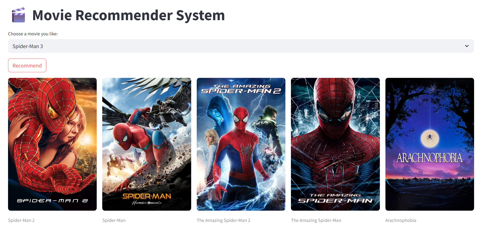

# Movie Recommender System

This project is a content-based movie recommender system that suggests movies similar to a user's favorite title by analyzing textual metadata such as genres, cast, crew, and keywords.

## Features

- Recommends top 5 similar movies using cosine similarity
- Extracts meaningful features using CountVectorizer from combined metadata
- Fetches movie posters dynamically using TMDb API
- Built with Python and popular libraries like pandas, scikit-learn, and Streamlit for interactive UI

## Live Demo

Try the live deployed app here:
Movie Recommender System on Streamlit Cloud
[https://movie-recommender-system-priyanshuverma87.streamlit.app/]

## Demo

## Dataset

The dataset used is a modified version of the TMDb 5000 Movie Dataset, which includes:
- movies.csv
- credits.csv

These datasets are preprocessed to extract relevant features and save similarity matrices for recommendations.

## Technologies Used

- Python 3.7+
- pandas – Data manipulation and analysis
- NumPy – Numerical computing
- scikit-learn – Feature extraction and similarity computation
- nltk – Text processing
- requests – HTTP requests to fetch movie posters from TMDb API
- Streamlit – Building and deploying interactive web apps
